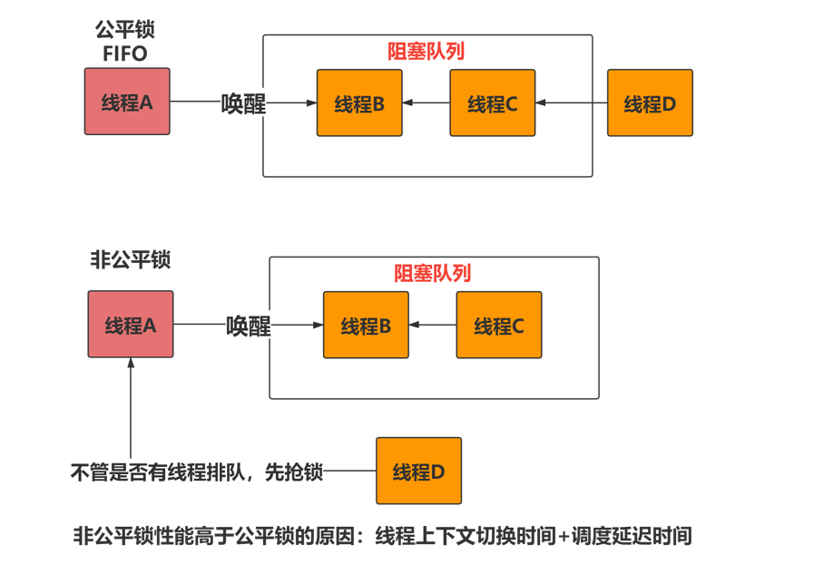

# AbstractQueuedSynchronizer(AQS)原理

类名分开理解

1. Abstract : 因为它并不知道怎么上锁。模板方法设计模式即可，暴露出上锁逻辑
2. Queue：线程阻塞队列
3. Synchronizer：同步器
4. CAS+state : 完成多线程抢锁逻辑
5. Queue  : 完成抢不到锁的线程排队

## 核心属性

```java
//锁的状态信息
private volatile int state; 
```


## 公平锁与非公平锁的区别



## Node内部类

 Node 静态内部类用于实现等待队列,该内部类用于作用AQS的阻塞队列，封装线程节点。

```java
static final class Node {
    /** Marker to indicate a node is waiting in shared mode */
    static final Node SHARED = new Node();
    // 标志当前线程节点的阻塞状态为：互斥节点
    static final Node EXCLUSIVE = null;

    //  唯一的大于0的节点，表示当前节点已经被取消，属于无效节点
    static final int CANCELLED =  1;
    // 表明当前节点是活动节点，可以唤醒后继的等待节点
    static final int SIGNAL    = -1;
    /** waitStatus value to indicate thread is waiting on condition */
    static final int CONDITION = -2;
    /**
     * waitStatus value to indicate the next acquireShared should
     * unconditionally propagate
     */
    static final int PROPAGATE = -3;

    // 代表了当前节点的状态值，简称ws，取值为以上4个
    volatile int waitStatus;

  
    volatile Node prev;

    
    volatile Node next;

  
    volatile Thread thread;

    
    Node nextWaiter;

   
    final boolean isShared() {
        return nextWaiter == SHARED;
    }

   
    final Node predecessor() throws NullPointerException {
        Node p = prev;
        if (p == null)
            throw new NullPointerException();
        else
            return p;
    }

    Node() {    // Used to establish initial head or SHARED marker
    }

    Node(Thread thread, Node mode) {     // Used by addWaiter
        this.nextWaiter = mode;
        this.thread = thread;
    }

    Node(Thread thread, int waitStatus) { // Used by Condition
        this.waitStatus = waitStatus;
        this.thread = thread;
    }
}
```


## acquire()

​	获取写锁（互斥锁）的代码。tryAcquire方法由子类来完成，该方法也称之为模板方法，为何如此设计？这是因为AQS无法知道子类如何定义获取锁的操作。假如子类判断当前线程没有获取到锁，那么如何？排队去。addWaiter(Node.EXCLUSIVE)方法用于排队站位，acquireQueued方法用于占位后去队列等待，此时不难猜出这里面肯定调用了tryAcquire(arg)，可以想想为什么？因为在任何过程中，都有可能别的线程已经释放了锁。

```java
public final void acquire(int arg) {
    if (!tryAcquire(arg) && // 子类判定获取锁失败返回false，那么这里取反，表示为 true
        acquireQueued(addWaiter(Node.EXCLUSIVE), arg)) // addWaiter方法为获取失败后添加到阻塞队列。进入阻塞队列后？考虑是否睡眠？
        selfInterrupt();
}

// 子类实现获取锁的逻辑，AQS并不知道你怎么用这个state来上锁
protected boolean tryAcquire(int arg) {
    throw new UnsupportedOperationException();
}
```

## addWaiter()

将阻塞线程节点放入阻塞队列。采用 全路径 + 优化前置 的技巧，实现快速入队。

```java
private Node addWaiter(Node mode) {
    // 创建等待节点：当前线程对象 + 锁模式（互斥锁？共享锁）
    Node node = new Node(Thread.currentThread(), mode);
    // 快速加入到队列
    Node pred = tail;
    if (pred != null) {
        node.prev = pred;
        if (compareAndSetTail(pred, node)) {
            // （面试重点，在后面进行操作时，最难理解，还有特重点在这里）特别注意：当上面的CAS成功后，有一瞬间 这里的pred.next并没有关联。会导致什么问题？有一瞬间，你通过head引用遍历的时候，是到达不了最后一个节点的，A(head)    ->     B(旧tail)   <-   C(tail)。如何获取最新的节点呢？通过tail指针往前遍历即可
            pred.next = node;
            return node;
        }
    }
    //如果cas没有设置成功，则从队尾进行入队
    enq(node);
    return node;
}

// 全路径入队方法
private Node enq(final Node node) {
    for (;;) {
        Node t = tail;
        if (t == null) { // 懒加载时，head和tail 分别代表aqs的头尾节点
            // 通过CAS实现原子初始化操作，直接用一个空节点实现初始化，此时head和tail指向同一个空节点
            if (compareAndSetHead(new Node()))
                tail = head;
        } else {
            node.prev = t;
            if (compareAndSetTail(t, node)) {
                t.next = node;
                return t;
            }
        }
    }
}
```

## acquireQueued()

当加入阻塞队列后，调用该方法考虑是否将当前线程进行阻塞。在看该方法时，请考虑一个情况：假如在添加到阻塞队列后，当前锁状态是无锁时， 怎么办？那么一定时尝试获取锁。

```java
// node节点为阻塞队列中的线程节点
final boolean acquireQueued(final Node node, int arg) {
    boolean failed = true;
    try {
        boolean interrupted = false;
        for (;;) {
            // 当前节点的前驱节点
            final Node p = node.predecessor();
            // 假如p是头结点，有可能此时头节点释放了锁，那么尝试调用tryAcquire，让子类抢一下锁
            if (p == head && tryAcquire(arg)) {
                // 获取成功，更新头点，释放引用
                setHead(node);
                p.next = null; // help GC
                failed = false;
                return interrupted;
            }
            // 如果前驱节点不是头节点或者抢锁失败，何如？那就先判断是否应该被阻塞，如果阻塞呢？调用parkAndCheckInterrupt方法来阻塞当前线程。
            if (shouldParkAfterFailedAcquire(p, node) &&
                parkAndCheckInterrupt())
                interrupted = true;
        }
    } finally {
        if (failed)
            cancelAcquire(node);
    }
}

// 阻塞当前线程。响应中断的方式阻塞线程
private final boolean parkAndCheckInterrupt() {
    LockSupport.park(this); // this是啥意思？用于指明当前线程阻塞在哪个对象上，后期可以通过jstack命令来看到，用于排除问题
    return Thread.interrupted(); // 判断是否是通过中断的方式来唤醒的。1、unpark 2、interrupt
}
```

## shouldParkAfterFailedAcquire()

该方法用于判断当前线程节点是否应该阻塞。无非就是找到一个可靠（活着有效）的节点，然后将当前线程节点作为其后继节点即可。

```java
// pred是前驱节点，node是当前线程节点
private static boolean shouldParkAfterFailedAcquire(Node pred, Node node) {
    int ws = pred.waitStatus;
    if (ws == Node.SIGNAL)
        // 如果前驱节点是SIGNAL，那么此时可以安全的睡眠（因为SIGNAL状态，代表了上一个线程是活的，它可以通知你，所以当前线程节点可以安全的阻塞了）
        return true;
    if (ws > 0) {
        // 前一个节点是CANCEL无效节点，那咋整？一直往前找，直到找到（有效节点）
        do {
            // 前驱节点的前驱节点，也即：踩着死亡节点往前跳
            Node predPrev = pred.prev;
            // 将前驱的前驱当成当前线程节点的前驱节点
            pred = predPrev;
            // 更新引用
            node.prev = pred;
        } while (pred.waitStatus > 0);
        // 更新找到的前驱有效节点的next引用，指向当前节点
        pred.next = node;
    } else {
        // 正常节点，那么CAS 将其变为SIGNAL
        compareAndSetWaitStatus(pred, ws, Node.SIGNAL);
    }
    return false;
}
```


## release()

释放写锁（互斥锁）的代码。

```java
public final boolean release(int arg) {
    // 子类判定释放锁成功
    if (tryRelease(arg)) {
        // 检查阻塞队列唤醒即可
        Node h = head;
        if (h != null && // AQS队列从来没被使用过
            h.waitStatus != 0) // 那就是SIGNAL=-1
            // 头结点为有效节点，且标注于需要唤醒后继节点，那么唤醒即可
            unparkSuccessor(h);
        return true;
    }
    return false;
}

// 子类实现获取锁的逻辑，AQS并不知道你怎么用这个state来上锁
protected boolean tryRelease(int arg) {
    throw new UnsupportedOperationException();
}
```

## unparkSuccessor()

该方法用于释放node节点后的有效后继节点。说白了，就是从node节点往后找到有效地节点，唤醒即可。

```java
private void unparkSuccessor(Node node) {
    // 开始唤醒后继节点，当前头节点，且ws=SINGAL，CAS将其变为0，代表了我当前已经响应了这一次的唤醒操作
    int ws = node.waitStatus;
    if (ws < 0)
        compareAndSetWaitStatus(node, ws, 0);
    // 取当前头结点的后继节点，作为唤醒节点，但是，请注意条件
    Node s = node.next;
    if (s == null ||  // 为什么这里有可能为空？因为我们首先更新的是tail引用，然后再是旧的tail.next所以有可能一瞬间为空
        s.waitStatus > 0) { // 后继节点居然是无效节点？？？
        s = null;
        // tail引用一定是最新的引用，那么从后往前找到 第一个（node节点的后继的第一个） 有效节点
        for (Node t = tail; t != null && t != node; t = t.prev)
            if (t.waitStatus <= 0)
                s = t;
    }
    // 找到了s节点，此时s就是要唤醒的节点
    if (s != null)
        LockSupport.unpark(s.thread);
}
```


## 总结

子类只需要实现自己的获取锁逻辑和释放锁逻辑即可，至于排队阻塞等待、唤醒机制均由AQS来完成。

