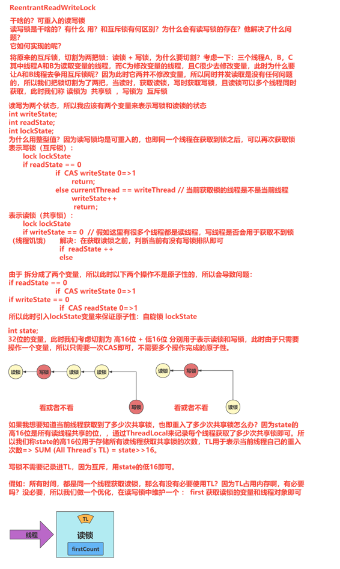

# ReentrantReadWriteLock 原理



（1）公平选择性：支持非公平（默认）和公平的锁获取方式，吞吐量还是非公平优于公平。公平锁仅对写锁公平

（2）重进入：读锁和写锁都支持线程重进入。

（3）锁降级：遵循获取写锁、获取读锁再释放写锁的次序，写锁能够降级成为读锁。

## 用例

将原来的锁，分割为两把锁：读锁、写锁。适用于读多写少的场景，读锁可以并发，写锁与其他锁互斥。写写互斥、写读互斥、读读兼容。

```java
public class ThreadDemo {
    static volatile int a;

    public static void readA() {
        System.out.println(a);
    }

    public static void writeA() {
        a++;
    }

    public static void main(String[] args) {
        ReentrantReadWriteLock reentrantReadWriteLock = new ReentrantReadWriteLock();
        ReentrantReadWriteLock.ReadLock readLock = reentrantReadWriteLock.readLock();
        ReentrantReadWriteLock.WriteLock writeLock = reentrantReadWriteLock.writeLock();
        Thread readThread1 = new Thread(() -> {
            readLock.lock();
            try {
                readA();
            } finally {
                readLock.unlock();
            }

        });
        Thread readThread2 = new Thread(() -> {
            readLock.lock();
            try {
                readA();
            } finally {
                readLock.unlock();
            }
        });

        Thread writeThread = new Thread(() -> {
            writeLock.lock();
            try {
                writeA();
            } finally {
                writeLock.unlock();
            }
        });

        readThread1.start();
        readThread2.start();
        writeThread.start();
    }
}
```

## 实现的接口

该接口用于获取读锁和写锁对象

```java

//实现的接口
public interface ReadWriteLock {
    // 用于获取读锁
    Lock readLock();
    // 用于获取写锁
    Lock writeLock();
}
```

readerLock和writerLock变量用于支撑以上描述的ReadWriteLock接口的读锁和写锁方法。通过构造方法得知，读写锁对象的创建和用例均依赖于公平锁或者非公平锁同步器。

## 构造方法和核心属性

```java
public class ReentrantReadWriteLock implements ReadWriteLock {
    // 读锁对象
    private final ReentrantReadWriteLock.ReadLock readerLock;
    // 写锁对象
    private final ReentrantReadWriteLock.WriteLock writerLock;
    // 同步器
    final Sync sync;
    // 默认构造器，创建了非公平锁
    public ReentrantReadWriteLock() {
        this(false);
    }
    // 根据fair变量，来选择创建不同的锁：公平锁 FairSync 和非公平锁 NonfairSync
    public ReentrantReadWriteLock(boolean fair) {
        sync = fair ? new FairSync() : new NonfairSync();
        // 用同步器来创建读写锁对象
        readerLock = new ReadLock(this);
        writerLock = new WriteLock(this);
    }
    public ReentrantReadWriteLock.WriteLock writeLock() { return writerLock; }
    public ReentrantReadWriteLock.ReadLock  readLock()  { return readerLock; }    
}
```

## Sync类

核心变量和构造器

我们说读锁可以多个线程同时持有，而写锁只允许一个线程持有，此时我们称 读锁-----共享锁  写锁------互斥锁（排他锁）。然后我们在AQS中了解到一个变量state，它是32位的值，那么我们这里将其切割为高16位和低16位。

```java
abstract static class Sync extends AbstractQueuedSynchronizer {
    // 高16位用于表示读锁
    static final int SHARED_SHIFT   = 16;
    // 用于对高16位操作：加1 减1 
    static final int SHARED_UNIT    = (1 << SHARED_SHIFT); //00000000000000010000000000000000
    // 最大读锁量
    static final int MAX_COUNT      = (1 << SHARED_SHIFT) - 1; //00000000000000001111111111111111
    // 用于获取低16位的值。
    static final int EXCLUSIVE_MASK = (1 << SHARED_SHIFT) - 1; //00000000000000001111111111111111

    /** 获取当前持有读锁的线程数量  */
    static int sharedCount(int c)    { return c >>> SHARED_SHIFT; }
    /** 获取当前持有写锁的线程数量 */
    static int exclusiveCount(int c) { return c & EXCLUSIVE_MASK; }

    // 高16位为所有读锁获取，那么我想知道每个线程对于读锁重入的次数？采用ThreadLocal来进行统计，每个线程自己统计自己的
    static final class HoldCounter {
        int count = 0;
        final long tid = getThreadId(Thread.currentThread());
    }
    // 继承自ThreadLocal，重写了其中的initialValue方法，该方法将在线程第一次获取该变量时调用初始化HoldCounter计数器
    static final class ThreadLocalHoldCounter
        extends ThreadLocal<HoldCounter> {
        public HoldCounter initialValue() {
            return new HoldCounter();
        }
    }
    // 创建ThreadLocal对象
    private transient ThreadLocalHoldCounter readHolds;
    // 缓存最后一个线程获取的读锁数量
    private transient HoldCounter cachedHoldCounter;
    // 保存获取到该锁的第一个读锁线程
    private transient Thread firstReader = null;
    // firstReader读锁线程获取到的读锁数量
    private transient int firstReaderHoldCount;

    Sync() {
        // 构造器中初始化ThreadLocalHoldCounter ThreadLocal对象
        readHolds = new ThreadLocalHoldCounter();
        // 用于保证可见性，使用了state变量的volatile语义
        setState(getState()); 
    }
}
```

## tryAcquire() 获取写锁的流程

由AQS调用，用于子类实现自己的上锁逻辑，和原有获取互斥锁保持一致，

```java
protected final boolean tryAcquire(int acquires) {
    // 获取当前线程
    Thread current = Thread.currentThread();
    // 获取当前状态值
    int c = getState();
    //获取互斥锁的数量
    int w = exclusiveCount(c);
    // 状态值有效，表示有线程获得了锁，但不确定是写锁还是读锁
    if (c != 0) {
        // state（c）是有锁状态，但写锁为0，表示有线程获取到了读锁 或者当前线程不是持有互斥锁的线程
        if (w == 0 ||  // 有线程获取到了读锁
            current != getExclusiveOwnerThread()) // 有其他线程获取到了写锁
            // 返回false 让AQS执行阻塞操作
            return false;
        // 写锁重入，而又由于写锁的数量保存在低16位，所以直接加就行了
        if (w + exclusiveCount(acquires) > MAX_COUNT) 
            throw new Error("Maximum lock count exceeded");
        setState(c + acquires); //增加写锁计数
        return true;
    }
    // 既没有读锁，也没有写锁
    if (writerShouldBlock() || // 由子类实现判断当前线程是否应该获取写锁
        !compareAndSetState(c, c + acquires)) // 通过CAS抢写锁
        return false;
    // 获取写锁成功，那么将当前线程标识为获取互斥锁的线程对象
    setExclusiveOwnerThread(current);
    return true;
}
```

## tryAcquireShared() 获取读锁的流程获取写锁的流程

```java
protected final int tryAcquireShared(int unused) {
    // 获取到当前线程对象
    Thread current = Thread.currentThread();
    // 获取到当前状态值
    int c = getState();
    if (exclusiveCount(c) != 0 && // 有没有线程持有写锁
        getExclusiveOwnerThread() != current) // 如果有线程获取到了互斥锁，那么进一步看看是不是当前线程
        // 不是当前线程，那么直接返回-1，告诉AQS获取共享锁失败，进行阻塞
        return -1;
    // 获取到读锁的持有数量
    int r = sharedCount(c);
    if (!readerShouldBlock() && // 让子类来判定当前获取读锁的线程是否应该被阻塞
        r < MAX_COUNT && // 判断是否发生了溢出
        compareAndSetState(c, c + SHARED_UNIT)) { // 直接CAS 增加state的高16位的读锁持有数量
        // 增加高16位之前的计数为0，此时表明当前线程就是第一个获取读锁的线程
        if (r == 0) {
            // 注意：持有两个变量来优化threadlocal 
            firstReader = current;
            firstReaderHoldCount = 1;
        } else if (firstReader == current) {
            // 当前获取读锁的线程就是一个线程，那么此时表明：锁重入，直接++计数位即可
            firstReaderHoldCount++;
        } else {
            // 当前线程不是第一个读线程，此时将其获取读锁的次数保存在ThreadLocal中
            HoldCounter rh = cachedHoldCounter;
            if (rh == null || rh.tid != getThreadId(current))
                //创建一个ThreadLocal线程，并且刷新cachedHoldCounter的值
                cachedHoldCounter = rh = readHolds.get();
            else if (rh.count == 0)
                readHolds.set(rh);
            rh.count++;
        }
        return 1;
    }
    // 有很多同学走到这里，直接懵逼？不知道这是啥情况？经验：在看doug lea写的代码时，请注意：经常做优化，就是把一些常见的场景前置判断，保证性能
    return fullTryAcquireShared(current);
}
```

## fullTryAcquireShared()完全获取读锁流程

```java
final int fullTryAcquireShared(Thread current) {
    HoldCounter rh = null;
    for (;;) {
        int c = getState();
        // 当前已经有线程获取到写锁且当前获取写锁的线程不是当前线程，返回-1 进行阻塞
        if (exclusiveCount(c) != 0) {
            if (getExclusiveOwnerThread() != current)
                return -1;
        } else if (readerShouldBlock()) {
            // 子类判断当前线程应该阻塞
            if (firstReader == current) {
                // 当前线程就是第一个获取到读锁的线程，所以不需要重复获取读锁
            } else {
                // 获取到当前线程记录读锁重入次数的HoldCounter对象
                if (rh == null) {
                    rh = cachedHoldCounter;
                    if (rh == null || rh.tid != getThreadId(current)) {
                        rh = readHolds.get();
                        if (rh.count == 0)
                            readHolds.remove();
                    }
                }
                // 当前读锁重入次数为0时，表明没有获取读锁，此时返回-1，阻塞当前线程
                if (rh.count == 0)
                    return -1;
            }
        }
        // 读锁获取次数溢出
        if (sharedCount(c) == MAX_COUNT)
            throw new Error("Maximum lock count exceeded");
        // CAS增加读锁次数
        if (compareAndSetState(c, c + SHARED_UNIT)) {
            if (sharedCount(c) == 0) {
                firstReader = current;
                firstReaderHoldCount = 1;
            } else if (firstReader == current) {
                firstReaderHoldCount++;
            } else {
                if (rh == null)
                    rh = cachedHoldCounter;
                if (rh == null || rh.tid != getThreadId(current))
                    rh = readHolds.get();
                else if (rh.count == 0)
                    readHolds.set(rh);
                rh.count++;
                cachedHoldCounter = rh;
            }
            return 1;
        }
    }
}
```

## tryRelease释放写锁的流程

```java
protected final boolean tryRelease(int releases) {
    // 没有获取写锁，为啥能释放写锁呢？
    if (!isHeldExclusively())
        throw new IllegalMonitorStateException();
    int nextc = getState() - releases;
    // 释放完毕后，写锁状态是否为0（锁重入），因为此时计算的不是当前state，是nextc
    boolean free = exclusiveCount(nextc) == 0;
    // 如果下一个状态值为0，此时表明当前线程完全释放了锁，也即锁重入为0，那么将当前线程对象从OwnerThread中移除
    if (free)
        setExclusiveOwnerThread(null);
    // 此时设置全局state变量即可
    setState(nextc);
    // 如果返回为true，那么由AQS完成后面线程的唤醒
    return free;
}
```

## tryReleaseShared释放读锁的流程

释放时，需要考虑：重入多少次，就释放多少次。总结：先完成自己的释放，然后再完成共享的高16位的释放。

```java
protected final boolean tryReleaseShared(int unused) {
    Thread current = Thread.currentThread();
    // 当前线程是第一个获取到读锁的线程
    if (firstReader == current) {
        // 当前重入次数为1，代表什么？代表可以直接释放，如果不是1，那么表明还持有多个读锁，也即重入多次，那么直接--
        if (firstReaderHoldCount == 1)
            firstReader = null;
        else
            firstReaderHoldCount--;
    } else {
        HoldCounter rh = cachedHoldCounter;
        if (rh == null || rh.tid != getThreadId(current))
            rh = readHolds.get();
        int count = rh.count;
        if (count <= 1) {
            // 当前线程已经释放完读锁，那么不需要在ThreadLocal里持有HoldCounter对象
            readHolds.remove();
            if (count <= 0)
                throw unmatchedUnlockException();
        }
        --rh.count;
    }
    for (;;) {
        // CAS释放高16位计数
        int c = getState();
        int nextc = c - SHARED_UNIT;
        if (compareAndSetState(c, nextc))
            // 释放完毕后是否为0，为无锁状态，此时需要干啥？由AQS来唤醒阻塞的线程
            return nextc == 0;
    }
}
```

## readerShouldBlock和writerShouldBlock模板方法公平锁实现

判断条件只有一个：hasQueuedPredecessors()方法，就是看看AQS的阻塞队列里是否有其他线程正在等待，如果有排队去。总结：有人在排队，那么不插队。w->r->r->r  此时来了个r：w->r->r->r->r， 此时来了个w：w->r->r->r->w。

```java
static final class FairSync extends Sync {
    final boolean writerShouldBlock() {
        return hasQueuedPredecessors();
    }
    final boolean readerShouldBlock() {
        return hasQueuedPredecessors();
    } // w->r->r   r获取锁  w->r->r-r
}
```

## readerShouldBlock和writerShouldBlock模板方法非公平锁实现

写线程永远false，因为读写锁本身适用的是读多写少，此时不应该 让写线程饥饿，而且非公平，写锁永远不阻塞，让它抢，不管前面是否有人排队，先抢了再说。apparentlyFirstQueuedIsExclusive()第一个排队的是不是写线程。r(10)，当前线程是第十一个，此时已经有一个写线程排队，r(10)->w，此时排队去。r(10)->w->r。

```java
static final class NonfairSync extends Sync {
    final boolean writerShouldBlock() {
        return false;
    }
    final boolean readerShouldBlock() {
        return apparentlyFirstQueuedIsExclusive();
    } // w->r->r   r获取锁  r->r->r
}
```

### 
